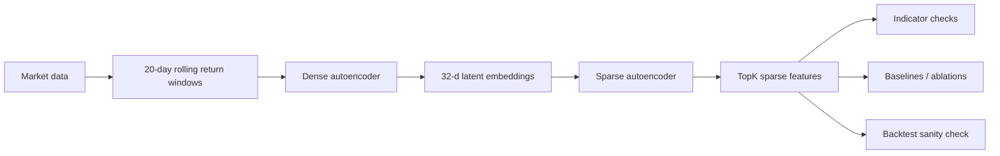

# Regime Interpretability

Exploratory undergraduate research project on whether sparse autoencoders can make learned market regime embeddings easier to interpret.

[Project page](https://astew24.github.io/regime-interpretability/) | [Slide deck](https://astew24.github.io/regime-interpretability/deck.html) | [GitHub repo](https://github.com/astew24/regime-interpretability)

## Abstract

Market regime models can compress useful structure from asset returns, but the learned representations are often difficult to explain. This project trains a dense autoencoder on rolling multi-asset return windows, then trains a sparse autoencoder on the frozen latent embeddings. The sparse features are checked against external indicators such as VIX, yield spread, SPY momentum, cross-asset correlation, HMM/K-means baselines, ablations, and a simple backtest sanity check.

This is an interpretability project, not a trading strategy. The feature labels are heuristic and the backtest is included only as a downstream plausibility check.

## Research Question

Can sparse autoencoders make dense market regime embeddings more inspectable by producing sparse features that align with recognizable market conditions?

## Pipeline



Current configuration:

| Setting | Value |
| --- | --- |
| Market universe | 15 tickers / indicators |
| Window size | 20 trading days |
| Dense latent dimension | 32 |
| Sparse dictionary size | 128 |
| Active sparse features | TopK 8 |
| Data source | `yfinance` |

## Repository Structure

```text
regime-interpretability/
|-- config.yaml
|-- data/                 # download, preprocessing, rolling windows
|-- models/               # dense and sparse autoencoder modules
|-- train/                # training entry points
|-- analysis/             # interpretability, baselines, ablations, backtest
|-- viz/                  # plotting helpers
|-- notebooks/            # result exploration notebook
|-- docs/                 # GitHub Pages site and slide deck
|-- results/              # generated outputs, not committed
`-- requirements.txt
```

## Installation

```bash
python -m venv .venv
source .venv/bin/activate
pip install -r requirements.txt
```

## Reproduce

```bash
python data/download.py --config config.yaml
python train/train_ae.py --config config.yaml
python train/train_sparse.py --config config.yaml
python analysis/interpretability.py --config config.yaml
python analysis/baselines.py --config config.yaml
python analysis/backtest.py --config config.yaml
python analysis/ablation.py --config config.yaml
```

## Expected Outputs

Running the pipeline writes generated artifacts under `results/`, including:

- dense autoencoder checkpoints and training curves
- dense latent embeddings
- sparse autoencoder checkpoint, dictionary weights, and sparse activations
- feature-to-indicator correlation tables
- heuristic sparse feature labels
- UMAP plots and event feature heatmaps
- HMM/K-means baseline transition summaries
- ablation tables
- SPY backtest sanity-check metrics and equity curves

Generated artifacts are intentionally not committed, except for `results/.gitkeep`.

## GitHub Pages

The static site lives in `docs/`:

- `docs/index.html` is the research landing page.
- `docs/deck.html` is a keyboard-navigable slide deck.

Preview locally with any static server, for example:

```bash
python -m http.server 8000 --directory docs
```

Then open `http://localhost:8000`.

## Limitations

- Data comes from `yfinance`, so results depend on Yahoo availability and symbol coverage.
- Sparse feature labels are heuristic and correlation-based.
- HMM and K-means baselines are simple comparison points, not heavily tuned models.
- The backtest is a sanity check, not evidence of alpha generation or production trading performance.
- Results should be rerun locally before being quoted.

## Future Work

- Add pinned sample outputs or a lightweight fixture for faster review.
- Improve experiment tracking for configs, seeds, and output metadata.
- Add tests for dataset construction and analysis helpers.
- Compare sparse features against PCA or factor-model baselines.
- Use calendar-aware event definitions for crisis and rate-shock windows.

## Credit

Built by Andrew Stewart at UC San Diego. Project supervision noted in the original project framing: Sanjoy Dasgupta, Dasgupta Lab.
